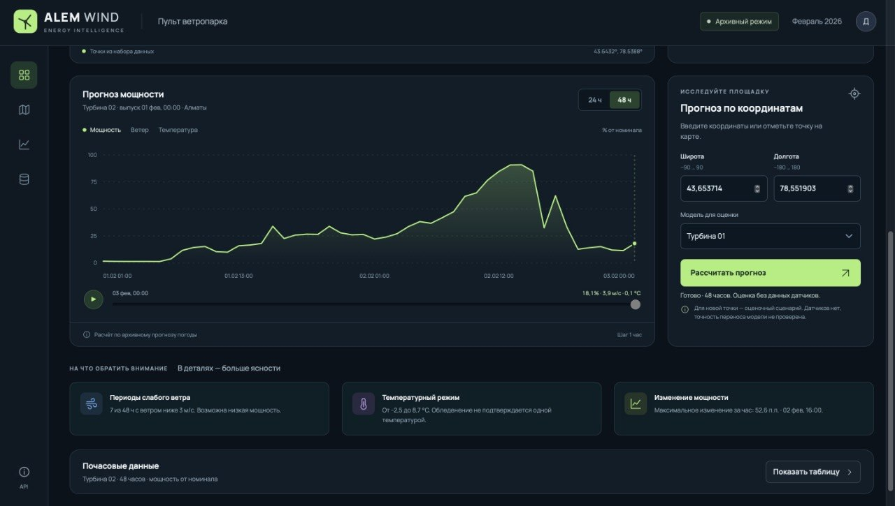
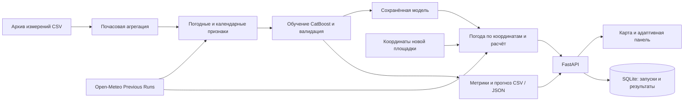

<div align="center">

# ALEM WIND

### Почасовой прогноз мощности ветроэлектростанции

Данные турбин · Архив погоды · CatBoost · Пульт диспетчера


</div>

СКРИНШОТ СИСТЕМЫ
Сохраните изображение в docs/images/dashboard.png и замените блок ниже строкой:



> **Место для скриншота системы**  
> Здесь будет общий вид панели: карта ВЭС, состояние турбины и прогноз на 48 часов.

---

## О проекте

**ALEM WIND** — прототип системы прогнозирования для энергетического кейса хакатона **HackAlem**. Он объединяет исторические измерения двух ветротурбин, архивные погодные прогнозы Open-Meteo и модель CatBoost в адаптивном веб-интерфейсе.

Цель проекта — автоматизировать ежедневное получение погоды и расчёт почасовой мощности на следующие **24–48 часов**. Сейчас реализованы ML-пайплайн, backend и интерфейс. Полный агентный цикл с ежедневными выпусками за весь февраль 2026 года остаётся следующим этапом.

> **Текущий режим:** архивный выпуск от **1 февраля 2026, 00:00**, часы прогноза **+1…+48**. Карточки турбин показывают последние доступные архивные измерения. Мощность хранится как доля номинала `[0, 1]`, на графиках отображается в процентах.

## Содержание

- [Возможности](#возможности)
- [Быстрый старт](#быстрый-старт)
- [Как работает система](#как-работает-система)
- [Данные и модель](#данные-и-модель)
- [Результаты валидации](#результаты-валидации)
- [API](#api)
- [Настройки](#настройки)
- [Экспорт CSV](#экспорт-csv)
- [Структура проекта](#структура-проекта)
- [Тесты](#тесты)
- [Ограничения](#ограничения)
- [План развития](#план-развития)

## Возможности

| Раздел | Что доступно |
| --- | --- |
| **Карта ВЭС** | Выбор двух исходных турбин, масштабирование, выбор новой точки |
| **Состояние турбины** | Последняя измеренная мощность, ветер, температура, время и полнота измерений |
| **Прогноз** | Горизонты 24/48 ч, графики мощности, ветра и температуры, ползунок и воспроизведение по часам |
| **Новая площадка** | Ручной ввод координат → архив погоды → расчёт сохранённой моделью |
| **Подробности** | Периоды слабого ветра, температурный диапазон, изменение мощности за час |
| **Выгрузка** | Почасовая таблица и CSV с русскими заголовками, датой и временем |
| **Мобильный интерфейс** | Последовательные блоки: карта → состояние → прогноз → координаты → подробности |
| **Backend** | Валидация CSV, хранение запусков и результатов, статусы расчёта, OpenAPI |

## Быстрый старт

### 1. Подготовьте окружение и данные

Нужны **Python 3.11**, **curl** и интернет для загрузки зависимостей, погоды и карты. Команды ниже предназначены для macOS/Linux и выполняются из корня проекта. Node.js и сборка frontend не требуются.

Положите исходные файлы в `~/Downloads/` с именами:

```text
Dataset HackAlemAI для участников 11.03.2023-28.02.2026 - turbine 1.csv
Dataset HackAlemAI для участников 11.03.2023-28.02.2026 - turbine 2.csv
```

Создайте окружение и установите зависимости:

```bash
python3 -m venv .venv
.venv/bin/python -m pip install -r requirements.txt
```

При первом запуске создайте файл настроек:

```bash
cp .env.example .env
```

Если `.env` уже существует, сохраните его текущие настройки.

### 2. Подготовьте модель и прогноз

```bash
.venv/bin/python run_stage1.py
```

Команда проверяет CSV, агрегирует измерения до часа, получает архив погоды, обучает модель и сохраняет метрики и прогноз в `outputs/`. Повторные запуски используют погодный кэш из `data/weather_cache/`.

Если модель и необходимые CSV уже подготовлены в `outputs/`, переходите к запуску приложения.

### 3. Запустите приложение

Примените миграции базы данных:

```bash
.venv/bin/alembic upgrade head
```

Запуск интерфейса и API одной командой:

```bash
.venv/bin/uvicorn hackalem_api.app:app --app-dir src --reload
```

| Адрес | Назначение |
| --- | --- |
| [localhost:8000](http://127.0.0.1:8000/) | Панель диспетчера |
| [localhost:8000/docs](http://127.0.0.1:8000/docs) | Интерактивная документация API |
| [localhost:8000/health](http://127.0.0.1:8000/health) | Проверка доступности API и БД |

Если порт занят, добавьте `--port 8001` и откройте [localhost:8001](http://127.0.0.1:8001/).

## Как работает система



Система поддерживает два сценария:

1. **Исходные турбины.** Панель читает архивные измерения и подготовленный прогноз из результатов ML-пайплайна.
2. **Новые координаты.** Backend запрашивает архив погоды для точки, строит признаки и вызывает сохранённую CatBoost-модель. Неизвестные лаги мощности передаются как пропуски. Показания датчиков для новой площадки отсутствуют.

Сервис `forecast-runs` хранит запуски в SQLite со статусами `queued → running → completed / failed`. Сейчас он загружает результаты из подготовленного `forecast_48h.csv`. Фоновая обработка реализована через FastAPI `BackgroundTasks` внутри процесса приложения.

## Данные и модель

### Исходные измерения

Фактический период предоставленных данных: **11.03.2023–31.01.2026**. Несмотря на дату в названиях файлов, фактических измерений за февраль 2026 в них нет.

| Поле CSV | Содержание |
| --- | --- |
| `ID` | Идентификатор строки |
| `Статистическое время` | Временная отметка с шагом 10 минут |
| `Средняя скорость ветра(m/s)` | Измеренная скорость ветра |
| `Нормализованная активная мощность` | Мощность в диапазоне `[0, 1]` |
| `Средняя температура окружающей среды(°C)` | Измеренная температура |

Предоставленные файлы используют UTF-8 с BOM и запятую-разделитель. Проверка выявляет некорректные значения, дубликаты и пропуски времени. Часовое значение рассчитывается как среднее при наличии **минимум 4 из 6 измерений для каждого показателя**. Исходные CSV сохраняются без изменений; данные турбин агрегируются отдельно.

### Погода и признаки

Источник — **Open-Meteo Previous Runs**. Для исходных близко расположенных турбин используется одна погодная точка сетки; при ручном вводе координат выполняется отдельный запрос с кэшированием по параметрам.

Модель использует:

- архивные прогнозы ветра, направления ветра, порывов, температуры и влажности;
- календарные признаки;
- идентификатор турбины и заблаговременность прогноза;
- два лага мощности, доступные к моменту выпуска.

Поля `observed_wind_ms` и `observed_temp_c` в объединённых данных оставлены для диагностики и не передаются модели как будущие признаки.

### Время и разделение выборок

- Временные отметки CSV не содержат UTC offset; сейчас они трактуются как локальные и сопоставляются с `Asia/Almaty` без сдвига. Это допущение требует подтверждения владельцем телеметрии.
- Обучение backtest-модели: данные **до 01.10.2025**.
- Валидация: **01.10.2025–31.01.2026**.
- Февраль 2026 исключён из обучения и валидации.
- Погодные признаки берутся из `previous_day1` и `previous_day2`.
- После валидации финальная модель обучается на допустимых данных до **01.02.2026**; её прогноз ограничивается диапазоном `[0, 1]`.

## Результаты валидации

Сохранённый результат из `outputs/metrics.json`. Ошибки приведены в долях номинальной мощности: **MAE 0,1665 соответствует 16,65 процентного пункта номинала**, а не проценту ошибки относительно фактической выработки.

| Модель / горизонт | MAE ↓ | RMSE ↓ | Число примеров |
| --- | ---: | ---: | ---: |
| **CatBoost — все примеры** | **0,1665** | **0,2414** | 11 580 |
| Persistence — все примеры | 0,3651 | 0,4844 | 11 580 |
| CatBoost — 24 ч | 0,1594 | 0,2315 | 5 790 |
| CatBoost — 48 ч | 0,1736 | 0,2509 | 5 790 |

Основная метрика — **MAE**, дополнительная — **RMSE**. Persistence использует последнюю доступную мощность на момент выпуска. Дополнительно рассчитываются сезонные baseline: тот же час предыдущего дня для горизонта 24 ч и двух дней назад для 48 ч.

> Эти результаты относятся к валидации исходных турбин. Та же выборка используется для выбора числа итераций через early stopping; отдельная итоговая тестовая оценка ещё не выполнена. Метрики не подтверждают качество на новых координатах или за февраль 2026.

## API

| Метод | Endpoint | Назначение |
| --- | --- | --- |
| `GET` | `/health` | Доступность API и базы данных |
| `GET` | `/api/v1/dashboard` | Турбины, архивные наблюдения, прогнозы и метрики |
| `POST` | `/api/v1/locations/forecast` | Расчёт для введённых координат |
| `POST` | `/api/v1/data/validate` | Валидация CSV, multipart-поле `file` |
| `POST` | `/api/v1/forecast-runs` | Создание запуска на 24 или 48 часов |
| `GET` | `/api/v1/forecast-runs` | Список запусков, параметр `limit` |
| `GET` | `/api/v1/forecast-runs/{run_id}` | Статус и количество результатов |
| `GET` | `/api/v1/forecast-runs/{run_id}/results` | Результаты с пагинацией `limit` / `offset` |

Пример расчёта новой площадки:

```bash
curl -X POST http://127.0.0.1:8000/api/v1/locations/forecast \
  -H 'Content-Type: application/json' \
  -d '{"latitude":43.6600,"longitude":78.5500,"horizon_hours":48,"reference_turbine_id":"1"}'
```

`horizon_hours` принимает `24` или `48`, `reference_turbine_id` — `"1"` или `"2"`. Новая площадка рассчитывается для того же фиксированного архивного выпуска. Ответ содержит почасовые прогнозы, координаты погодной сетки и описание ограничений переноса модели.

## Настройки

Backend читает `.env` через **Pydantic Settings**. Пути по умолчанию определяются относительно корня проекта.

| Переменная | Назначение / значение по умолчанию |
| --- | --- |
| `DATABASE_URL` | SQLite: `data/hackalem.db` |
| `FORECAST_CSV_PATH` | `outputs/forecast_48h.csv` |
| `HOURLY_CSV_PATH` | `outputs/hourly_power.csv` |
| `MODEL_PATH` | `outputs/catboost_power.cbm` |
| `METRICS_PATH` | `outputs/metrics.json` |
| `WEATHER_CACHE_DIR` | `data/weather_cache/` |
| `MAX_UPLOAD_BYTES` | Лимит входного CSV: 26 214 400 байт (25 МиБ) |

Погодные запросы в текущем коде выполняются без API-ключа. Поля `WEATHER_SOURCE` и `OPEN_METEO_API_KEY` в `.env.example` зарезервированы и пока не переключают источник или авторизацию. Скрипты этапа 1 используют собственные пути и параметры, а не настройки backend.

## Экспорт CSV

Кнопка **«Выгрузить прогноз»** сохраняет выбранную турбину или новую площадку на выбранном горизонте 24/48 ч.

- Русские заголовки и подписи единиц измерения.
- Отдельные столбцы даты `ДД.ММ.ГГГГ` и времени `ЧЧ:ММ:СС` для выпуска и каждого часа прогноза.
- Явный часовой пояс `Asia/Almaty`; время не пересчитывается в часовой пояс браузера.
- Координаты, название площадки, режим расчёта, мощность, ветер и температура.
- Кодировка **UTF-8 с BOM**, разделитель **`;`**, десятичная **запятая**.

При ручном импорте в Excel или другой табличный редактор выберите эти параметры. Мощность в CSV сохраняется как **доля номинала 0–1**. Этот пользовательский формат экспорта отличается от внутренних CSV пайплайна.

## Структура проекта

```text
.
├── frontend/                  # Интерфейс: HTML, CSS, JavaScript
│   └── vendor/leaflet/         # Локальная библиотека карты
├── src/hackalem_api/           # FastAPI, настройки, модели БД
│   └── services/              # CSV-валидация, запуски, расчёт по координатам
├── scripts/
│   ├── inspect_turbine_data.py # Аудит исходных измерений
│   ├── build_hourly_dataset.py # Почасовая агрегация
│   ├── join_weather_data.py    # Получение и присоединение погоды
│   └── train_stage1.py         # Обучение, валидация, прогноз
├── migrations/                # Миграции Alembic
├── tests/                     # Проверки API и сервисов
├── data/                      # SQLite и погодный кэш
├── outputs/                   # Модели, прогнозы и метрики
├── .env.example               # Пример конфигурации
├── requirements.txt           # Зависимости Python
└── run_stage1.py               # Последовательный запуск ML-пайплайна
```

<details>
<summary><strong>Артефакты ML-пайплайна</strong></summary>

| Файл в `outputs/` | Содержимое |
| --- | --- |
| `hourly_power.csv` | Почасовые измерения и целевая мощность |
| `hourly_training_weather.csv` | Целевые значения и архивные погодные признаки |
| `catboost_backtest.cbm` | Модель для валидации |
| `catboost_power.cbm` | Финальная модель до тестового периода |
| `metrics.json` | Метрики CatBoost и baseline |
| `backtest_predictions.csv` | Факты и прогнозы на валидации |
| `forecast_48h.csv` | 48-часовой прогноз отдельно для каждой турбины |
| `forecast_48h.json` | Тот же прогноз в JSON |

</details>

Сущности базы данных: `Turbine`, `Measurement`, `WeatherForecast`, `ForecastRun`, `ForecastValue`.

## Тесты

```bash
.venv/bin/pytest
```

В проекте есть проверки API, валидации входных параметров, данных панели, расчёта новой площадки и разделения погодного кэша по координатам. Набор тестов не является оценкой точности модели на новых ВЭС.

## Ограничения

- **Фиксированный выпуск.** Выбор произвольной даты и ежедневный пересчёт за весь февраль ещё не реализованы.
- **Архивная телеметрия.** Живые датчики не подключены; статус выработки определяется по мощности. Аварийные сигналы не предоставлены.
- **Новые площадки.** Перенос модели двух турбин на другие координаты экспериментальный; его точность не оценена.
- **Сильный мороз.** В исходной истории температура опускается примерно до −19 °C. Для −30 °C качество модели не подтверждено; одна температура не позволяет диагностировать обледенение.
- **Единицы мощности.** Для перевода в МВт и расчёта энергии в МВт·ч нужны номинальные мощности турбин и подтверждённая схема нормализации.
- **Историческая доступность погоды.** Перед итоговой защитой требуется проверить соответствие архивных погодных выпусков фактическому моменту принятия решения для каждого дня тестового периода.
- **Инфраструктура MVP.** Распределённая очередь, восстановление фоновых задач после перезапуска и пользовательская авторизация пока отсутствуют.

Карта использует **Leaflet 1.9.4** и тайлы **OpenStreetMap** с атрибуцией. Лицензия Leaflet находится в `frontend/vendor/leaflet/LICENSE`. Загрузка карты и получение новой погоды требуют интернета; ошибки погодного источника отображаются в интерфейсе.

## План развития

- [x] Аудит CSV и почасовая агрегация.
- [x] Архивные погодные признаки, CatBoost и baseline.
- [x] Валидация по времени и сохранение артефактов.
- [x] FastAPI, SQLite, SQLAlchemy и миграции Alembic.
- [x] Адаптивная панель, интерактивная карта и расчёт по координатам.
- [x] Экспорт CSV с русскими заголовками и временем.
- [ ] Подтверждение часового пояса исходной телеметрии.
- [ ] Ежедневный агентный цикл за 01–28 февраля 2026 с журналом действий.
- [ ] Контроль времени доступности погодных выпусков и повторные попытки при сбоях.
- [ ] Независимая итоговая оценка и интервалы неопределённости.
- [ ] Учёт простоев, технических ограничений и условий сильного холода.
- [ ] Онлайн-телеметрия, авторизация и устойчивая очередь расчётов.

---

<div align="center">

**ALEM WIND · HackAlem · Энергетика**

</div>
